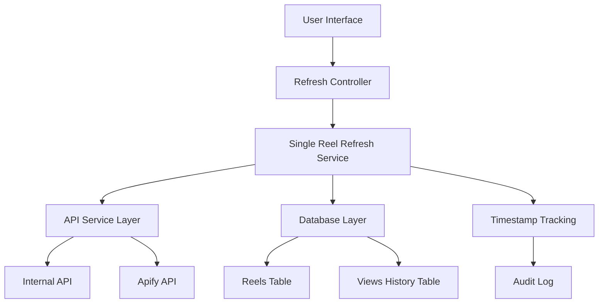

# Design Document: Unrestricted Single Reel Refresh

## Overview

This design removes all time-based restrictions from the single reel refresh functionality while maintaining proper timestamp tracking and data integrity. The current system has time-based limitations in the `getRefreshRecommendation` function that prevent refreshes if the last refresh was less than 6 hours ago. This enhancement will allow users to refresh any individual reel at any time while preserving audit trails and data consistency.

The solution focuses on modifying the existing `refreshSingleReel` function and related UI components to bypass time restrictions while maintaining all other functionality including error handling, progress tracking, and data storage.

## Architecture

The system follows a layered architecture:



### Component Responsibilities

- **User Interface**: Always-enabled refresh buttons without time-based indicators
- **Refresh Controller**: Orchestrates refresh operations without time validation
- **Single Reel Refresh Service**: Core refresh logic with timestamp tracking
- **API Service Layer**: External data fetching (unchanged)
- **Database Layer**: Data persistence with proper timestamp management
- **Timestamp Tracking**: Audit trail maintenance without restrictions

## Components and Interfaces

### Modified Components

#### 1. Single Reel Refresh Service
```typescript
interface UnrestrictedRefreshService {
  refreshSingleReel(
    reelId: string,
    shortcode: string,
    permalink: string,
    userEmail: string,
    onProgress?: (status: string) => void
  ): Promise<RefreshResult>;
  
  // Remove time-based validation
  validateRefreshRequest(reelId: string): Promise<ValidationResult>;
}

interface ValidationResult {
  isValid: boolean;
  reason?: string; // Never time-related
}
```

#### 2. Refresh Controller
```typescript
interface RefreshController {
  // Remove time-based recommendation logic for single reels
  canRefreshSingleReel(reelId: string): boolean; // Always returns true
  
  // Keep batch refresh recommendations (separate concern)
  getBatchRefreshRecommendation(): RefreshRecommendation;
}
```

#### 3. User Interface Components
```typescript
interface RefreshButtonProps {
  reelId: string;
  shortcode: string;
  permalink: string;
  disabled?: boolean; // Only for loading states, never time-based
  onRefresh?: (result: RefreshResult) => void;
}
```

### New Components

#### 1. Timestamp Audit Service
```typescript
interface TimestampAuditService {
  recordRefreshAttempt(
    reelId: string,
    timestamp: Date,
    userEmail: string,
    success: boolean
  ): Promise<void>;
  
  getRefreshHistory(reelId: string): Promise<RefreshHistoryEntry[]>;
}

interface RefreshHistoryEntry {
  timestamp: Date;
  userEmail: string;
  success: boolean;
  viewsGrowth?: number;
}
```

## Data Models

### Existing Tables (Modified)

#### Reels Table
```sql
-- Add index for better performance on unrestricted refreshes
CREATE INDEX IF NOT EXISTS idx_reels_last_refreshed 
ON reels(last_refreshed_at DESC);

-- Ensure last_refreshed_at is always updated
ALTER TABLE reels 
ALTER COLUMN last_refreshed_at SET DEFAULT NOW();
```

#### Views History Table
```sql
-- Add refresh attempt tracking
ALTER TABLE views_history 
ADD COLUMN IF NOT EXISTS refresh_attempt_id UUID DEFAULT gen_random_uuid();

-- Add index for audit queries
CREATE INDEX IF NOT EXISTS idx_views_history_refresh_attempts 
ON views_history(reel_id, recorded_at DESC);
```

### New Tables

#### Refresh Audit Log
```sql
CREATE TABLE IF NOT EXISTS refresh_audit_log (
  id UUID PRIMARY KEY DEFAULT gen_random_uuid(),
  reel_id UUID NOT NULL REFERENCES reels(id) ON DELETE CASCADE,
  shortcode TEXT NOT NULL,
  attempted_at TIMESTAMPTZ NOT NULL DEFAULT NOW(),
  attempted_by_email TEXT,
  success BOOLEAN NOT NULL,
  error_message TEXT,
  views_before INTEGER,
  views_after INTEGER,
  views_growth INTEGER,
  response_time_ms INTEGER,
  created_at TIMESTAMPTZ NOT NULL DEFAULT NOW()
);

CREATE INDEX idx_refresh_audit_reel_time 
ON refresh_audit_log(reel_id, attempted_at DESC);

CREATE INDEX idx_refresh_audit_user_time 
ON refresh_audit_log(attempted_by_email, attempted_at DESC);
```

## Correctness Properties

*A property is a characteristic or behavior that should hold true across all valid executions of a system-essentially, a formal statement about what the system should do. Properties serve as the bridge between human-readable specifications and machine-verifiable correctness guarantees.*

### Property 1: Unrestricted Refresh Access
*For any* reel and any timestamp (date, hour, or time), when a user initiates a single reel refresh, the system should process the request without applying any temporal restrictions or cooldown periods.
**Validates: Requirements 1.1, 1.2, 1.3, 1.4, 1.5**

### Property 2: Immediate Processing
*For any* single reel refresh request, the system should begin processing within 1 second and process requests in FIFO order without time-based queuing delays.
**Validates: Requirements 2.1, 2.2, 2.4**

### Property 3: Single Reel Priority
*For any* combination of single reel and batch refresh requests submitted simultaneously, single reel requests should be processed before batch operations.
**Validates: Requirements 2.3**

### Property 4: Time-Free Error Messages
*For any* refresh failure scenario, error messages should provide actionable information without mentioning time restrictions, cooldowns, or suggesting time-based waiting periods.
**Validates: Requirements 3.1, 3.3, 3.4**

### Property 5: Immediate Retry Capability
*For any* failed refresh attempt, the system should allow immediate retry attempts without enforcing time-based delays.
**Validates: Requirements 3.2**

### Property 6: Always-Enabled UI
*For any* single reel refresh button, it should be enabled at all times and not display time-related tooltips, countdown timers, or time-based status indicators.
**Validates: Requirements 4.1, 4.2, 4.3, 4.4**

### Property 7: Complete Data Updates
*For any* successful reel refresh, all analytics metrics should be updated with the latest data while maintaining consistency across all related database tables and preserving historical data.
**Validates: Requirements 5.1, 5.2, 5.3**

### Property 8: Proper Timestamp Management
*For any* refresh operation, the system should accurately record timestamps for audit purposes while ensuring these timestamps never restrict future refresh operations.
**Validates: Requirements 5.4, 5.5, 5.6, 5.7**

## Error Handling

### Error Categories

#### 1. API-Related Errors
- **Network failures**: Allow immediate retry without time delays
- **Rate limiting**: Return clear error without suggesting time-based solutions
- **Invalid responses**: Provide actionable feedback excluding temporal advice

#### 2. Database Errors
- **Connection issues**: Enable immediate retry attempts
- **Constraint violations**: Return specific error information
- **Transaction failures**: Maintain data integrity without time restrictions

#### 3. Validation Errors
- **Invalid reel ID**: Return immediate feedback
- **Missing parameters**: Provide clear error messages
- **Permission issues**: Return authorization errors without time suggestions

### Error Response Format
```typescript
interface RefreshError {
  success: false;
  reelId: string;
  shortcode: string;
  error: string; // Never mentions time restrictions
  errorCode: string;
  retryable: boolean; // Always true for single reel refreshes
  timestamp: Date;
}
```

## Testing Strategy

### Dual Testing Approach

The testing strategy employs both unit tests and property-based tests to ensure comprehensive coverage:

**Unit Tests**: Verify specific examples, edge cases, and error conditions
- Test specific refresh scenarios with known inputs
- Verify error handling for specific failure cases
- Test UI component behavior in specific states
- Validate database operations with known data

**Property-Based Tests**: Verify universal properties across all inputs
- Test refresh functionality across random timestamps and dates
- Verify error messages never contain time-related text across all failure scenarios
- Test UI behavior across random states and conditions
- Validate data consistency across random refresh sequences

### Property-Based Testing Configuration

Using **fast-check** for TypeScript property-based testing:
- Minimum 100 iterations per property test
- Each property test references its design document property
- Tag format: **Feature: unrestricted-reel-refresh, Property {number}: {property_text}**

### Test Categories

#### 1. Functional Tests
- Refresh processing without time restrictions
- Data update accuracy and completeness
- Error handling and retry capabilities
- UI state management

#### 2. Integration Tests
- Database consistency across refresh operations
- API integration without time-based delays
- End-to-end refresh workflows
- Multi-user concurrent refresh scenarios

#### 3. Performance Tests
- Response time validation (< 1 second processing start)
- Concurrent refresh handling
- Database query optimization
- Memory usage during refresh operations

#### 4. Security Tests
- User permission validation
- Data access control
- Audit trail integrity
- Input sanitization

### Mock Strategy

Minimize mocking to test real functionality:
- Mock external APIs (Instagram, Apify) for consistent testing
- Use real database connections with test data
- Avoid mocking internal business logic
- Test actual UI components with real state management